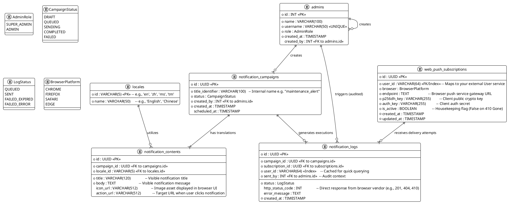

# Push Notification Service Architecture

## Data Structure

## Entities

### admins
- Stores admin users with role-based access control
- Supports audit trail via `created_by` foreign key
- Roles: SUPER_ADMIN, ADMIN

### locales
- Enables multi-language support for notification content
- Standard locale identifiers (e.g., 'en', 'zh', 'ms', 'tm')

### web_push_subscriptions
- Stores browser push service endpoints for each user
- Includes encryption keys required by Web Push API (p256dh, auth)
- `is_active` flag for handling 410 Gone responses from push services

### notification_campaigns
- Represents a batch of notifications to be sent
- Lifecycle: DRAFT → QUEUED → SENDING → COMPLETED/FAILED
- Supports scheduled delivery

### notification_contents
- Translated content for each campaign and locale
- Includes title, body, icon, and action URL

### notification_logs
- Tracks every delivery attempt
- Records HTTP status from browser vendors
- Supports user-level and campaign-level analytics
- Cached `user_id` for query efficiency
